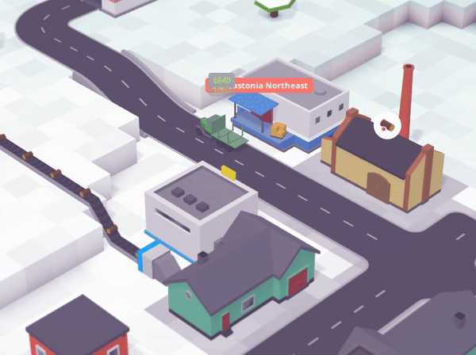
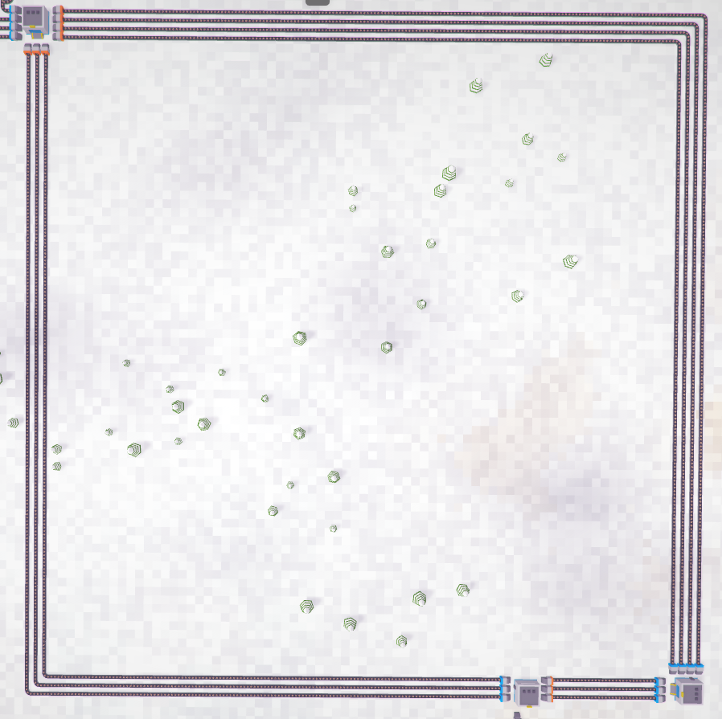
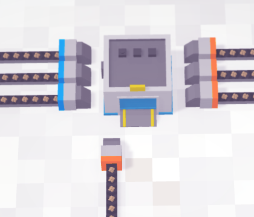
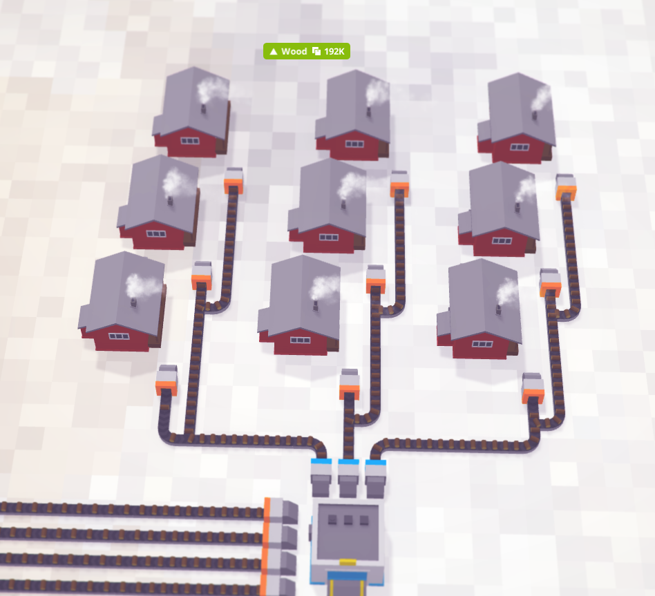
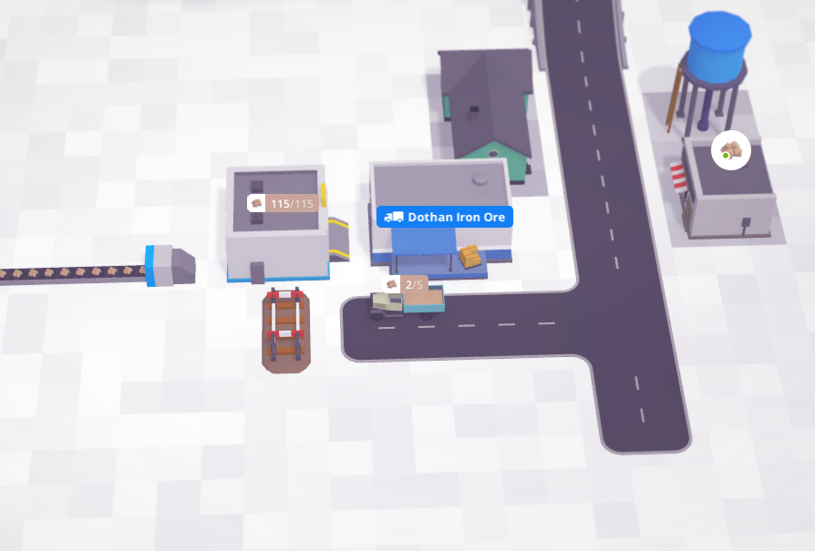
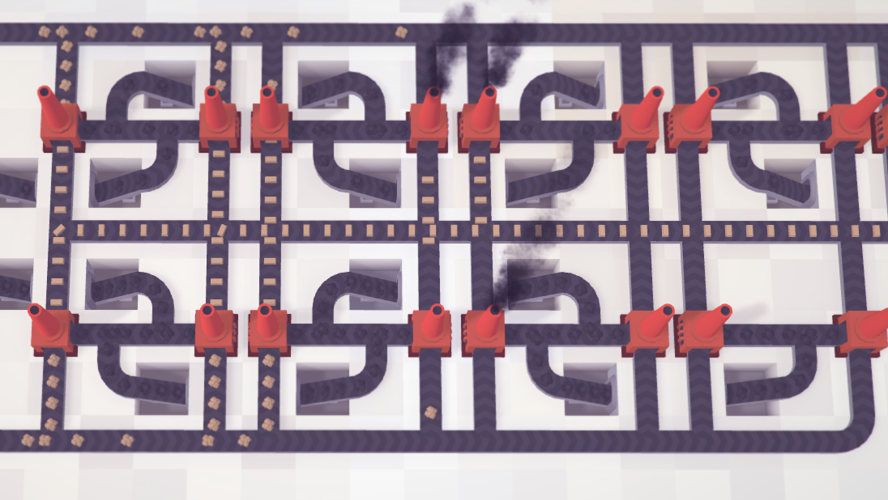
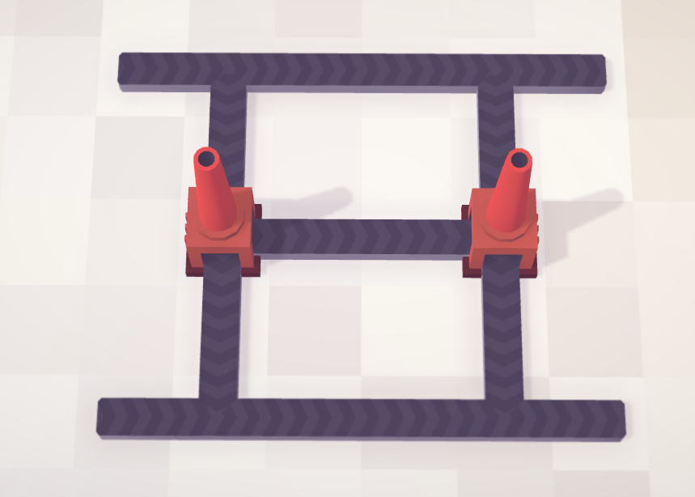
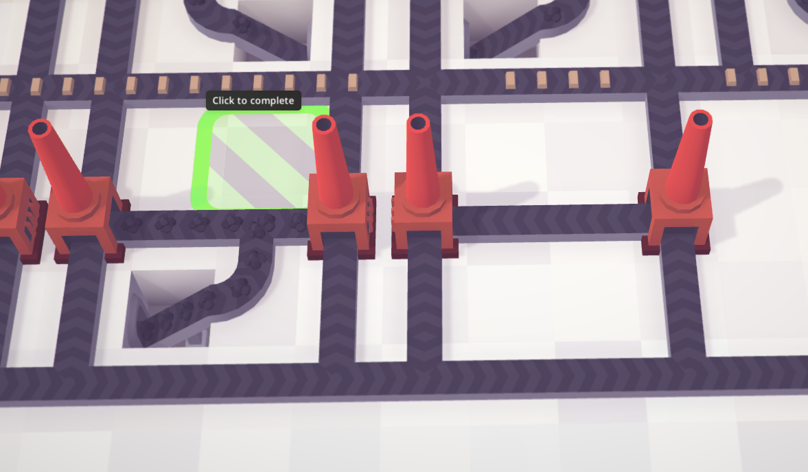
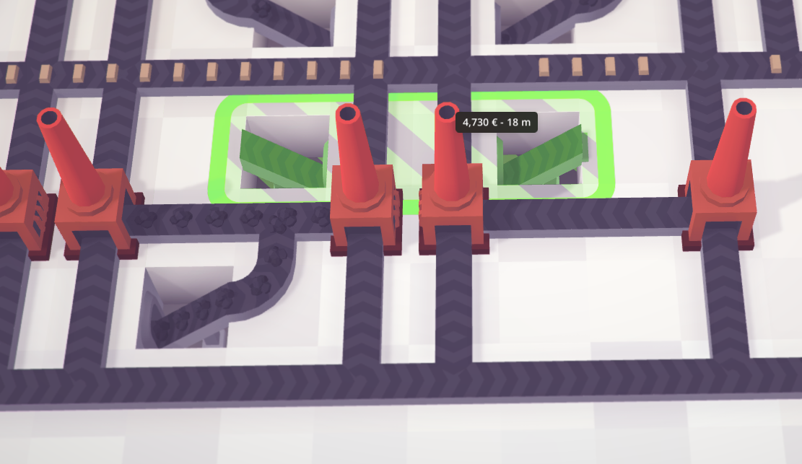
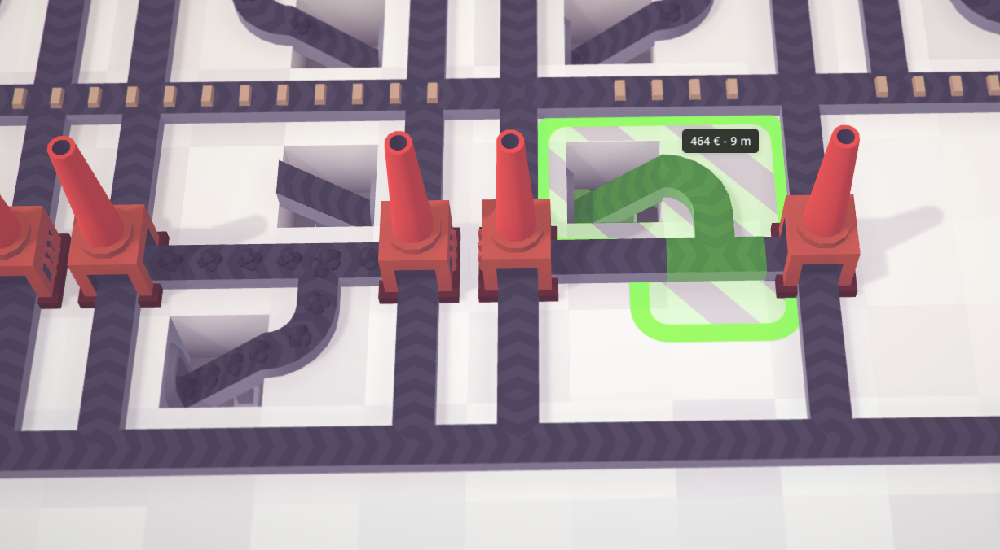

# Abusing Conveyors For Fun and Profit



Some say conveyors are the most boring way to move resources around in Voxel
Tycoon. I find them incredibly fun, and I've gotten kinda burnt out on trains
over tens of hours of Railway Empire. Here's my guide to abusing conveyors to
their maximum potential.

Let's start with the fundamental definition we'll need for our conveyor
shenanigans.

**Saturation** - a node in a conveyor network is **saturated** when it
receives resources at a rate equal or higher to the rate it consumes or
outputs them. You should keep every end node of your conveyor network at
saturation! On the other hand, if an intermediate node is saturated but the end
node isn't, you've got a *bottleneck*, and will have to expand the intermediate
node to stop it from hurting your efficiency. If you have a warehouse with two
saturated inputs but only one output, then either one of the inputs is
unnecessary, or you need to build another output.

Three resource mines saturate one conveyor. You can see this clearly in the
gif at the top of this guide - the conveyor is connected to a single sawmill,
and there is about two logs' worth of room between every log on it.

A warehouse connector output doesn't saturate a conveyor! You can still fit
some more resources on the output of a warehouse. Four outputs do saturate
three inputs, so the ideal ratio is probably something like a 5:4.

Here are the basic buildings you'll need to make use of:

- **Conveyors**

  Of course. These do one simple thing - they move resources. A conveyor
  that splits into two will divide resources somewhat equally between them.
  This does mean that if you want to divide resources from an unsaturated line
  equally, you have to structure your conveyor network like a binary tree, not
  chain them:

  ```
  Bad:

  v input
  |
  |
  +--- this branch receives 50% of the resources
  | the other 50% goes straight down
  |
  +--- this branch receives 50% of the 50%, so 25% of the resources
  | the other 25% goes straight down
  |
  +--- this branch receives 12.5% of the resources
  | the other 12.5% goes straight down
  etc ...


  Good:
            +-- 25%
        50% |
         +--+
         |  |
  input  |  +-- 25%
  >------+
         |  +-- 25%
         |  |
         +--+
        50% |
            +-- 25%
  ```

- **Connectors**

  Connectors are the end nodes of every conveyor line. A connector is three
  tiles long, but the third tile is a conveyor and can overlap with existing
  conveyors (but not connectors) - so, if you want to place a connector at the
  end of a conveyor line, it must be attached to a building that is at least
  two cells away from the conveyor. If you want to build two connectors facing
  each other, you must leave six cells of room between the buildings they'll be
  attached to.

- **Warehouses**

  Warehouses serve as resource storage that road terminals can take resources
  out of, but for our purposes they have another extremely important use - they
  serve as buffers to extend the range of conveyors. Note that there are actual
  conveyor buffers (in the Decorations category), but I find them inelegant to
  use and annoying to expand later on.

  A basic warehouse buffer is just a warehouse with as few or as many inputs
  and outputs as you need. A maximum throughput buffer looks like this:
  

  Note that warehouses are a 4x3 rectangle, and so they can have at most 14
  connectors (4+4+3+3). To build a max-length buffer, start with the outermost
  connector on the four-wide side, drag it out to its maximum horizontal
  length, then go down/up to its maximum vertical length, and build your next
  warehouse two cells down from there. Make sure the orientation is correct -
  every buffer warehouse should be offset 90 degrees from the previous one (so
  that the four-wide sides are connected to the four-wide sides, and ditto for
  the three-wide ones).

  To branch off a buffer, just place a warehouse somewhere on the way. Just
  make sure the sides match up.
  

  If you reverse the direction of half of a buffer, you've built a conveyor
  loop! They're like bidirectional buffers - they keep resources distributed
  between all of their outputs, and take them from all of their inputs. If you
  build your entire conveyor network using conveyor loops, you can take inputs
  from anywhere, and they will be distributed to every end node in the network
  that isn't saturated - and you'll appreciate that with how fast you're going
  to be burning through resource deposits!

- **Mines**

  Mines dig up and output resources via connectors. A mine outputs slightly less
  than a third of the conveyors' saturation rate and pretty much exactly a third
  of the connector input's saturation rate, so it doesn't make sense to have
  more than three mines per connector. Here's what an example setup looks like:
  

- **Terminals**

  Terminals are where the magic happens.

  Terminals have to be set up in range of a store and a warehouse with the
  resource demanded by the store. You then buy the cheapest truck that can
  carry the given resource, set its schedule to load and unload repeatedly at
  that same terminal, and watch it sit there for the rest of its sorry
  existence loading and unloading the same resource over and over, making you
  loads of sweet, sweet money.

  For that very reason, terminals should be built out of the way - trucks are
  too dumb to path around the other trucks that are parked at the terminal
  forever, and if they try to path through them, they'll just get stuck there
  waiting for the other truck to move - which it will never do. If this
  happens, just send the stuck truck back to the garage, remove the road that
  it tried to path through, and send it out again.

  Ideally, you'll also want to block off the road with a piece of rail or
  conveyor, to make sure when the cities expand they don't make your road lead
  anywhere. Here's what an average terminal looks like:
  

  Since the trucks are parked there forever, you want to have one terminal per
  store.

- **Factories**

  Factories are resource processors - they take in one or more resources, and
  output something else. While using some of them is dead simple (the ones with
  a single input and output - just dump resources into it), some take more
  deliberation. Keep in mind the ratio at which they consume resources! If it
  takes five of resource A and two of resource B for a factory's recipe, you'll
  need to supply them at a 5:2 ratio - keep that in mind when building
  conveyors. You'll need just a single coal conveyor for every five iron ore
  conveyors when setting up iron bar smelters!

  Speaking of smelters, they're possibly the most tricky factory to use, due to
  their T shape. Here's how I build my smelter clusters for them to be 100%
  space efficient:
  

  A single saturated iron ore input can supply somewhere around seven smelters.
  For iron bars, that means you'll want five iron ore inputs and thirty five
  smelters per coal input for maximum efficiency.

  Here is how to build the cluster. This is the most basic segment of the
  cluster:
  

  You can use any of the three conveyor lines for any of the three resources. I
  usually use the middle for coal, and the other two for iron ore and iron
  bars.
  This segment can be mirrored forever in both directions to expand your network. Here's how to connect them up, since building conveyors in that small, one-cell-wide space is a bit tricky.

  First, select your conveyor tool and click on the empty space closest to your
  new segment. Press T to switch to tunneling mode (or B for bridges, if that's
  what you prefer! Bridges are a bit nicer, because then you can tunnel a
  different conveyor line under the entire cluster instead of having your
  bridges be limited by the space between smelters)
  

  Click on that cell to build a single-cell bridge or tunnel start point. Then
  drag it over to the right and click again to build it:
  

  Then click on either the tunnel end point or the cell you're going to connect
  it to and connect your bridge to the smelters.
  

  Make sure that your conveyors are going in the right directions! Bonus points
  if you spotted that a segment going up into one of the smelters on the last
  three screenshots is pointing the wrong way :)
